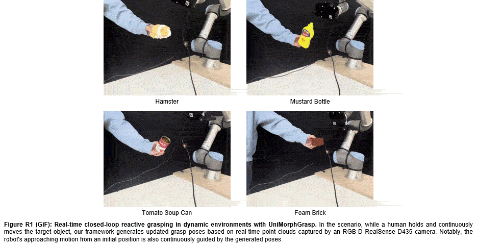
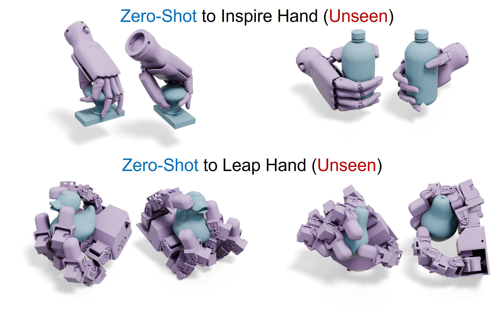
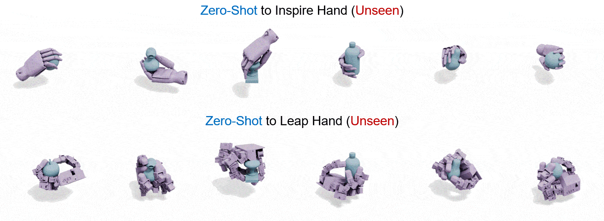

Additional Materials for UniMorphGrasp

 

 
 

<b>Video 1: Real-time closed-loop reactive grasping in dynamic environments with UniMorphGrasp.</b> In the scenario, while a human holds and continuously moves the target object, our framework generates updated grasp poses based on real-time point clouds captured by an RGB-D RealSense D435 camera. Notably, the robot's approaching motion from an initial position is also continuously guided by the generated poses. 

 

 

<b>Figure 1: Qualitative results of zero-shot generalization to completely unseen hand structures.</b> We evaluated our pre-trained model on the Inspire hand (top) and the Leap hand (bottom) with distinct kinematic structures, which are completely unseen during training. The results further demonstrate our UniMorphGrasp's strong zero-shot generalization capabilities to novel morphologies without any retraining. Two viewing angles are presented for each grasp. 

  

<b>Video 2: 360° visualizations of zero-shot generalization to completely unseen hand structures.</b> We demonstrate more grasps of the unseen Inspire hand and Leap hand generated by our UniMorphGrasp. 

 

 
 

<b>Video 3: Diverse grasping strategies executed in the real world.</b> To validate the method's versatility in practical scenarios, we execute the generated grasps on real-world objects using diverse initial poses and approaching directions, including grasping from the left, from above, and from the right.

